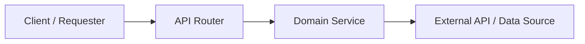

## 📌 Summary
<!-- Concise high-level overview of the feature, change, or fix, and its architectural significance -->

──────

## 🎯 Motivation & Key Capabilities
<!-- Bulleted list of key technical capabilities, design choices, and business/domain motivation -->
* **Capability / Component Name**: Description of functionality, compliance standards, and edge-case handling.

──────

## 🏗️ Architecture Flow
<!-- Mermaid flowchart visualizing data flow, API routing, service delegation, or component interaction -->


──────

## 🚀 API Endpoints Added
<!-- Markdown table detailing all new or modified HTTP endpoints. -->
| Method | Path | Description | Query / Path Params |
| :--- | :--- | :--- | :--- |
| METHOD | `/path` | Purpose and response behavior | `param` (type, constraint, default) |

──────

## 📂 File Changes
<!-- Bulleted list of every modified and created file with file link and concise explanation of additions or refactors -->
* **filename.py**: Description of models, services, routers, or tests modified or introduced.

──────

## 🧪 Testing & Verification
<!-- Command executed to test changes, along with a bulleted list of passing test highlights -->

All automated tests pass cleanly with pytest:

```bash
uv run pytest
```

### Test Coverage Highlights:
* ✅ `test_case_name`: Purpose and assertion verified.

──────

## ✅ Checklist
* [ ] Code follows existing architecture and style guidelines
* [ ] Unit and integration tests written and passing
* [ ] API documentation (OpenAPI / Swagger) updated
* [ ] Input validation with FastAPI constraints implemented
* [ ] External service resilience / rate limiting / edge cases handled
* [ ] README updated with completed roadmap item
