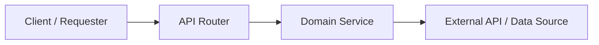

# Project Rules & Guidelines

## Pull Request Documentation Standard

Whenever generating or drafting a Pull Request (PR) title, summary, or description for this repository, you **MUST** format the PR description using the following template structure and sections:

---

### Pull Request Format Template

```markdown
## 📌 Summary
<!-- Concise high-level overview of the feature, refactor, or fix, explaining its architectural purpose and downstream integration. -->

──────

## 🎯 Motivation & Key Capabilities
<!-- Bulleted breakdown of core capabilities, technical innovations, and domain logic implemented. Use bold lead-in tags. -->
* **Capability / Component Name**: Description of functionality, compliance standards, and edge-case handling.

──────

## 🏗️ Architecture Flow
<!-- Mermaid flowchart visualizing data flow, API routing, service delegation, or component interaction. -->


──────

## 🚀 API Endpoints Added
<!-- Markdown table detailing all new or modified HTTP endpoints. For frontend PRs, table can list UI Views / Components. -->
| Method | Path | Description | Query / Path Params |
| :--- | :--- | :--- | :--- |
| METHOD | `/path` | Purpose and response behavior | `param` (type, constraint, default) |

──────

## 📂 File Changes
<!-- Bulleted list of every modified and created file with file link and concise explanation of additions or refactors. -->
* **filename.py**: Description of models, services, routers, or tests modified or introduced.

──────

## 🧪 Testing & Verification
<!-- Command used to run automated test suites, followed by coverage highlights for individual test cases. -->

All automated tests pass cleanly with pytest:

```bash
uv run pytest
```

### Test Coverage Highlights:
* ✅ `test_case_name`: Purpose and assertion verified.

──────

## ✅ Checklist
* [✓] Code follows existing architecture and style guidelines
* [✓] Unit and integration tests written and passing
* [✓] API documentation (OpenAPI / Swagger) updated
* [✓] Input validation with FastAPI constraints implemented
* [✓] External service resilience / rate limiting / edge cases handled
* [✓] README updated with completed roadmap item
```

---

### Reference Example

```markdown
## 📌 Summary
This PR introduces automated quantitative financial statement extraction and financial ratio analysis powered by SEC EDGAR XBRL (Company Facts API). It establishes the quantitative foundation for Phase 3, enabling multi-period balance sheet, income statement, and profitability tracking across annual (10-K) and quarterly (10-Q) filings to support downstream ML anomaly detection, volatility modeling, and frontend visualization dashboards.

──────

## 🎯 Motivation & Key Capabilities
* **SEC EDGAR XBRL Company Facts Ingestion**: Direct integration with `https://data.sec.gov/api/xbrl/companyfacts/CIK{cik}.json` with fair-access User-Agent compliance, HTTP 429 rate-limit handling, and cached CIK resolution.
* **Adaptive US-GAAP Concept Mapping**: Flexible tag candidate matching prioritizing modern ASC 606 revenue concepts (`RevenueFromContractWithCustomerExcludingAssessedTax`) while supporting legacy GAAP (`Revenues`, `SalesRevenueNet`), non-controlling interest equity disclosures, and short-term debt instruments.
* **Fundamental Accounting Derivations**: Automatically derives missing line items using accounting identities (`Gross Profit = Revenue - Cost of Revenue`, `Liabilities = Assets - Equity`, `Equity = Assets - Liabilities`).
* **Strict Period & Form Isolation**: Enforces clean separation between 10-K (Annual) and 10-Q (Quarterly) filings, filtering out cumulative 6/9-month YTD entries ($<115$ days) to capture true 3-month single-quarter operating performance.
* **Quantitative Financial Ratios & Performance Metrics**:
  * **Profitability Margins**: Gross Margin, Operating Margin (EBIT), and Net Profit Margin.
  * **Liquidity & Solvency**: Current Ratio, Debt-to-Equity, and Debt-to-Assets.
  * **Returns**: Return on Equity (ROE, safely returning `None` when equity is negative per institutional reporting standards) and Return on Assets (ROA).
  * **Growth**: Year-over-Year (YoY) revenue and net income growth rates comparing strictly consecutive fiscal years (`year - 1`) and identical quarters across years.

──────

## 🏗️ Architecture Flow
```mermaid
flowchart LR
    Client["Frontend / ML Analyzer"] -->|GET /api/v1/sec/financials/{ticker}| Router["SEC Router"]
    Router --> SecEdgar["SecEdgarService"]
    Router --> MetricsEngine["FinancialMetricsService"]
    SecEdgar -->|1. Lookup CIK| SEC_Tickers["SEC Tickers API (/files/company_tickers.json)"]
    SecEdgar -->|2. Fetch XBRL Facts| SEC_Facts["SEC Company Facts API (/api/xbrl/companyfacts/CIK.json)"]
    SEC_Facts --> FactsData["US-GAAP Facts JSON"]
    FactsData --> MetricsEngine
    MetricsEngine -->|3. Normalize Concepts & Derivations| Normalized["Statement Items"]
    MetricsEngine -->|4. Compute Ratios & YoY Growth| RatiosEngine["Ratios & Margins Engine"]
    RatiosEngine --> Result["Structured Financial Statements & Ratios"]
    Result --> Router --> Client
```

──────

## 🚀 API Endpoints Added

| Method | Path | Description | Query / Path Params |
| :--- | :--- | :--- | :--- |
| GET | `/api/v1/sec/financials/{ticker}` | Fetches US-GAAP facts from SEC EDGAR XBRL and calculates key financial metrics and ratios (margins, liquidity, solvency, YoY growth) | `ticker` (path, required, 1-10 chars), `annual_limit` (query, default: 5, 1-20), `quarterly_limit` (query, default: 8, 1-30) |

──────

## 📂 File Changes

* **financials.py**: New Pydantic v2 schemas defining [`FinancialStatementMetrics`](file:///Users/oanagrigore/Projects/financial-news-researcher-backend/app/schemas/financials.py#L4-L26), [`FinancialRatios`](file:///Users/oanagrigore/Projects/financial-news-researcher-backend/app/schemas/financials.py#L29-L62), [`PeriodFinancials`](file:///Users/oanagrigore/Projects/financial-news-researcher-backend/app/schemas/financials.py#L65-L81), and [`CompanyFinancialsResponse`](file:///Users/oanagrigore/Projects/financial-news-researcher-backend/app/schemas/financials.py#L84-L98).
* **sec_edgar.py**: Extended [`SecEdgarService`](file:///Users/oanagrigore/Projects/financial-news-researcher-backend/app/services/sec_edgar.py#L86-L190) with `get_company_facts()` supporting pre-resolved CIK reuse and HTTP 429 rate-limiting detection.
* **financial_metrics.py**: Built [`FinancialMetricsService`](file:///Users/oanagrigore/Projects/financial-news-researcher-backend/app/services/financial_metrics.py#L125-L485) containing GAAP concept resolution, missing item derivation, non-finite number guards (`math.isfinite()`), fact overwriting guards, and multi-period ratio formulas.
* **sec.py**: Added `/financials/{ticker}` endpoint, typed FastAPI dependency injection aliases (`SecServiceDep`, `MetricsServiceDep`), and path parameter validation.
* **README.md**: Updated development roadmap marking Phase 3 *Financial Metrics Extraction* as completed.
* **test_financials.py**: Comprehensive pytest suite (11 test cases) covering ratio calculations, missing derivations, consecutive year checks, negative equity ROE, 429 rate limiting, path validation, and 404/502 error scenarios.

──────

## 🧪 Testing & Verification

All automated tests pass cleanly with pytest:

```bash
uv run pytest
```

### Test Coverage Highlights:

* ✅ `test_safe_divide`: Verify safe division with non-finite floats, zero denominators, and precision rounding.
* ✅ `test_extract_company_financials_annual_and_quarterly`: Verify end-to-end extraction and ratio computations for 10-K and 10-Q filings.
* ✅ `test_derive_missing_gross_profit_and_cost`: Verify automatic derivation of gross profit from revenue and cost of revenue.
* ✅ `test_get_financials_endpoint_success`: Verify HTTP 200 response with structured annual and quarterly metrics.
* ✅ `test_get_financials_endpoint_unknown_ticker`: Verify 404 response for unregistered tickers.
* ✅ `test_get_financials_endpoint_invalid_ticker_path`: Verify 422 input validation for invalid ticker length/characters.
* ✅ `test_get_financials_endpoint_sec_network_error`: Verify 502 error handling on upstream connection failure.
* ✅ `test_get_financials_endpoint_sec_rate_limited`: Verify 429 error propagation when SEC EDGAR enforces rate limits.
* ✅ `test_non_consecutive_years_yoy_growth_is_none`: Verify that gaps in annual reporting years do not produce false 1-year YoY growth.
* ✅ `test_negative_stockholders_equity_roe_is_none`: Verify that negative stockholders' equity sets ROE to `None` per institutional standard.
* ✅ `test_bidirectional_equity_derivation`: Verify reciprocal derivation of stockholders' equity from assets and liabilities.

──────

## ✅ Checklist

* [✓] Code follows existing architecture and style guidelines
* [✓] Unit and integration tests written and passing (33/33 tests passing)
* [✓] API documentation (OpenAPI / Swagger) updated
* [✓] Input validation with FastAPI `Path` constraints implemented
* [✓] Upstream SEC EDGAR rate limiting (HTTP 429) handled gracefully
* [✓] README updated with completed Phase 3 roadmap item
```

---

## FastAPI Dependency Injection Standard (Dependency Aliases)

When declaring and injecting dependencies across FastAPI routes, services, and middleware in this repository, you **MUST** adhere to the following dependency injection rules:

### 1. Prohibition of Default `= None` on Typed Dependencies
- **DO NOT** assign `= None` (or any dummy default value) to a dependency parameter:
  ```python
  # ❌ INCORRECT (Triggers Pylance/Pyright: "None" is not assignable to "ServiceType")
  service: Annotated[SecEdgarService, Depends(get_sec_service)] = None
  ```
- With `typing.Annotated`, FastAPI automatically discovers and resolves dependencies via `Depends(...)`. Setting `= None` falsely signals to static type checkers that the parameter is nullable, triggering type errors.

### 2. Mandatory Use of Reusable Dependency Type Aliases (`*Dep`)
- **ALWAYS** declare reusable type aliases using `typing.Annotated` with a name ending in `Dep`:
  ```python
  # ✅ CORRECT: Clean, reusable, self-documenting alias
  SecServiceDep = Annotated[SecEdgarService, Depends(get_sec_service)]
  MetricsServiceDep = Annotated[FinancialMetricsService, Depends(get_financial_metrics_service)]
  RevenueServiceDep = Annotated[RevenueResearcherService, Depends(get_revenue_service)]
  ```
- **Cross-cutting / Global Dependencies**: Dependencies used across multiple modules (such as application settings) must be exported directly from their source module:
  ```python
  # In app/core/config.py:
  SettingsDep = Annotated[Settings, Depends(get_settings)]

  # In route/service modules:
  from app.core.config import SettingsDep

  def get_sec_service(settings: SettingsDep) -> SecEdgarService:
      return SecEdgarService(settings=settings)
  ```

### 3. Route Parameter Ordering Standard
- In Python, parameters without default values cannot follow parameters with default values.
- Because dependency parameters do not have default values, order route handler arguments as follows:
  1. Required Path / Query parameters / Request payloads (no default)
  2. Injected Dependencies (e.g. `service: SecServiceDep`, `metrics: MetricsServiceDep`)
  3. Optional Query parameters (with default values, e.g. `limit = 10`, `form_type = None`)

```python
# ✅ CORRECT Signature Pattern:
@router.get("/financials/{ticker}", response_model=CompanyFinancialsResponse)
def get_company_financials(
    ticker: Annotated[str, Path(min_length=1, max_length=10)],  # 1. Required Path
    sec_service: SecServiceDep,                                 # 2. Injected Dependency
    metrics_service: MetricsServiceDep,                         # 2. Injected Dependency
    annual_limit: Annotated[int, Query(ge=1, le=20)] = 5,       # 3. Optional with default
    quarterly_limit: Annotated[int, Query(ge=1, le=30)] = 8,    # 3. Optional with default
) -> CompanyFinancialsResponse:
    ...
```

